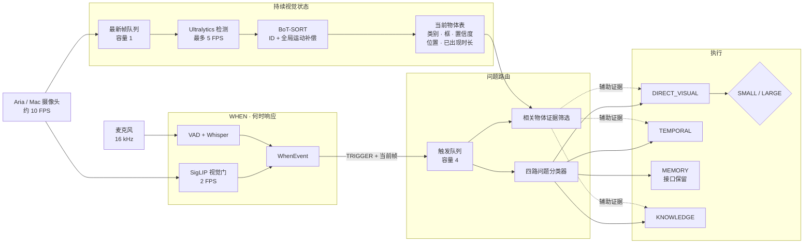
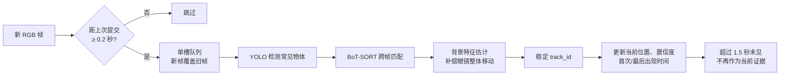
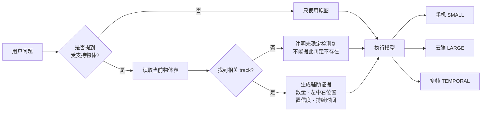

# Routing full pipeline 架构

## 1. 在线主链路

## 2. 持续物体跟踪如何工作

默认跟踪 COCO 中与眼镜场景较相关的 19 类物体，包括人、常见交通工具、包、杯瓶、
桌椅、屏幕、手机、书、猫和狗。类别、模型、FPS 和阈值都可在 `.env` 中调整；手和门
不在基础 COCO 类别中，需要以后接自定义或开放词汇检测模型。

## 3. 跟踪结果如何帮助回答

检测信息只作为辅助，提示模型仍需以原图或多帧为准。这样可以帮助计数、目标定位和
跨帧状态判断，同时避免检测器漏检时直接给出错误结论。
